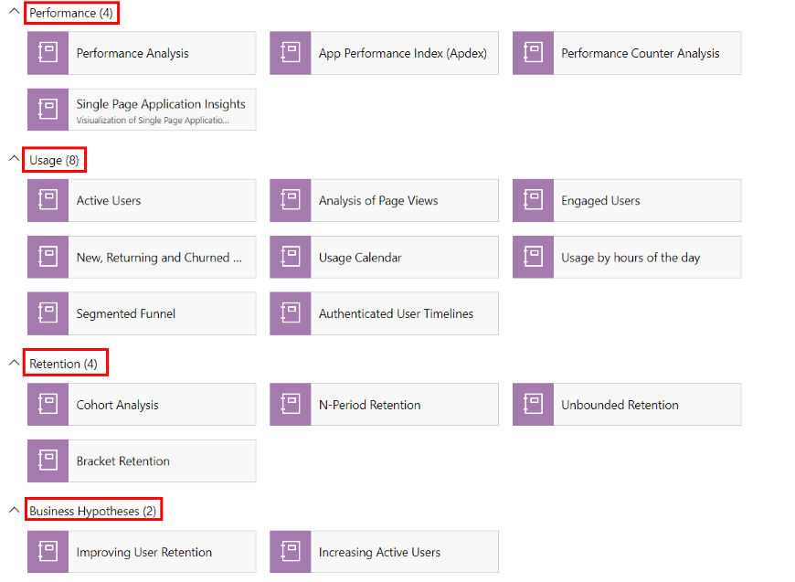
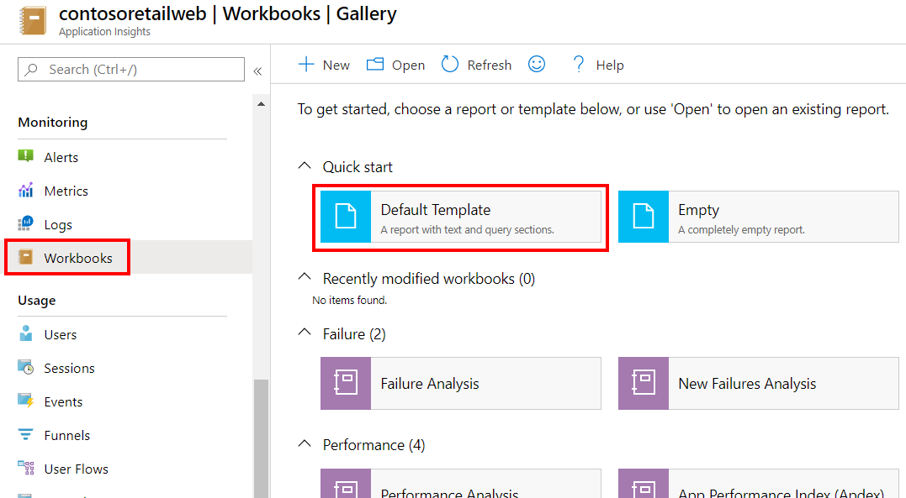
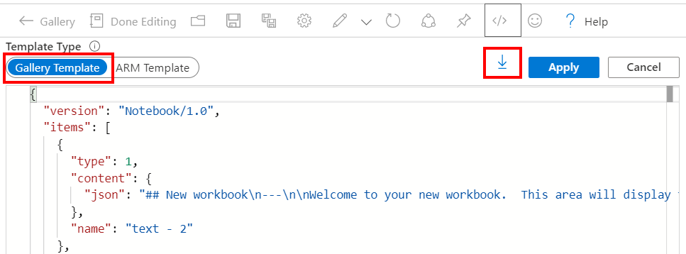

# Contributing to the Template Gallery

If you haven't already read the top level [Contributing](../CONTRIBUTING.md) docs, read that first to find out how to get contributor access to the repo.

## Template Format
Workbook templates follow a certain folder structure.
```
Root
 |
 |- Workbooks
       |- Category A
             |- categoryResources.json
             |- Template A
                    |- TemplateA.workbook
                    |- settings.json
                    |- icon.svg
             |- Template B
                    |- TemplateB.workbook
                    |- settings.json
                    |- icon.svg
       |- Category B
             |- categoryResources.json
             |- Template C
                    |- TemplateC.workbook
                    |- settings.json
                    |- icon.svg
             |- Template D
                    |- TemplateD.workbook
                    |- settings.json
                    |- icon.svg
```
## Category folder
```
Root
 |
 |- Workbooks
       |- Category folder 1
       |- Category folder 2       
...       
```
The template galleries of the Workbooks tools are organized into categories, like Business Hypotheses, Performance, and Usage. Each category can contain many templates.


To define a category, specify a categoryResources.json file per the category folder. The categoryResources.json file may contain localized versions of the category name, and a description if you are performing localization yourself. Here's an example categoryResources.json file.
```json
{
    "$schema": "https://github.com/Microsoft/Application-Insights-Workbooks/blob/master/schema/settings.json",
    "en-us": {"name":"Business Hypotheses", "description": "Long description goes here", "order": 100}
}
```


## Template folder
Each category folder contains a list of templates.
```
|- Category A
        |- categoryResources.json
        |- Template A
            |- TemplateA.workbook
            |- settings.json
            |- icon.svg
        |- Template B
            |- TemplateB.workbook
            |- settings.json
            |- icon.svg
```

Avoid using special characters (like `/\&?`) in your folder names. An optional icon file can be a PNG, SVG, or other common image format. Only one icon file per template is currently supported.

Each template folder contains the following files:
* **.workbook file** - You can create a template file from Workbooks in the Azure portal. See the "How to create a .workbook file" section for more details.  Ideally, the filename of the template is the same as its folder name, to make items easier to find by name.
* **settings.json file** - This file describes a template with metadata.
    ```json
        {
            "name":"Improving User Retention",
            "description": "Long description goes here",
            "icon": "",
            "tags": ["Foo", "Bar"],
            "author": "Microsoft",
            "galleries": [{ "type": "workbook", "resourceType": "microsoft.insights/components", "order": 300 }],
            "order": 100,
            "$schema": "..//schema/settings.json"
        }
    ```
    * name: A localized name.
    * description: A localized description.
    * icon: Optional. If you don't specify "icon" property, it will use the default icon. Otherwise, specify the name of icon file that is located under the template folder. 
    * tags: Optional. You can specify a list of tags that describes the template.
    * author: The name of author or company who contributes.
    * galleries: Optional. Settings for gallery view. Please note that this is not available for Cohorts templates.
        * type: Workbook type like 'tsg', 'performance', and etc. The default value is 'workbook'
        * resourceType: ARM resource type. The default value is 'microsoft.insights/components'
        * order: When specified it will be display in the ascending order.
    * order: If you have more than one template within a category and would like to order them in certain way, you can specify sort order. This will be overriden by the order within galleries if available.

## How to create a .workbook file
There are three ways of creating a template. 
* Create from the default template.
* From the existing template. You can modify or enhance the existing template.
* From the existing report. You can modify or enhance the existing report.

## Create from the default template
1. Go to http://portal.azure.com 
2. Select an Application Insights resource
3. Select "Workbooks"
4. Select Default Template under Quick Start section.

    

5. Modify report as you wish and click "Advanced Editor" button from the menu. 

    

6. Use the download button or copy all contents and create a file like `your custom template name.workbook`. 
   Make sure the file name ends with `.workbook` and avoid using any special characters (like `/\&?`) in your file name.
    

## Create from an existing template
1. Go to http://portal.azure.com 
2. Select an Application Insights resource or Azure Monitor from the navigation bar.
3. Select "Workbooks"
4. Select a template you are interested.
5. Modify report as you wish and click "Advanced Editor" button from the menu. 
6. Use the download button, or copy contents and create a file like `your custom template name.workbook`. 
   Make sure the file name ends with `.workbook` and avoid using any special characters (like `/\&?`) in your file name.
	
## Create from an existing report
1. Go to http://portal.azure.com 
2. Select an Application Insights resource or Azure Monitor from the navigation bar.
3. Select "Workbooks"
4. Click on Open icon from the menu.
5. Select a desired saved report you want to start with.
6. Modify report as you wish and click "Advanced Editor" button from the menu. 
7. Use the download button, or copy contents and create a file like `your custom template name.workbook`. 
   Make sure the file name ends with `.workbook` and avoid using any special characters (like `/\&?`) in your file name.

## How to associate any existing template to an additional category in Workbooks
You may also associate a templates to an virtual categories, not just the folder based categorie above. Previously, a category was always associated with templates by a folder structure but this requires to create physical folder structure which requires copying existing templates. This would introduce a lot of maintenance overhead of updating duplicated templates.

First, to associate the existing template, we need to create a virtual category first.
1. Go to Workbooks folder and locate "resourceCategory.json" file.
2. Add new category entry under categories array as below:
    ```json
    {
    "categories": [{
            "key": "YourSampleUniqueCategoryKey",
            "settings": {
            "en-us": {
                "name": "Sample Category",
                "description": "Category description",
                "order": 100
                }
            }      
        }]
    }
    ```
    * key: This should be unique key value. This will be used in a template to link together.
    * settings:
        * name: This is a name of category. This will be localized.
        * description: A description of this category.
        * order: The sort order of category.
3. Now we need to modify template settings to associate it together.
4. Go to your template and open settings.json file
    ```jsonc
    {
        "$schema": "..//schema/settings.json",
        "name": "Bracket Retention",
        "author": "Microsoft",
        "galleries": [
            {
                "type": "workbook",
                "resourceType": "microsoft.insights/components",
                "order": 400
            },
            // This is the new section to add:
            {
                "type": "workbook",
                "resourceType": "Azure Monitor",
                "categoryKey": "YourSampleUniqueCategoryKey",
                "order": 400
            }
        ]
    }
    ```
    **Note that the second item in the galleries array, it has a "categoryKey". It should be match with a "key" in a virtual category.**

# How to make changes (add, modify templates)

1. Clone the repo, if you haven't already. If you have already, `git checkout master` and `git pull` to make sure you are up to date
2. Create a new branch `git checkout -b nameOfNewBranch`
3. Create a folder in the `Workbooks` folder, or find an existing category folder if you are making a new category
4. Within that folder, create a new folder for your new workbook.  Put your .workbook and settings.json file there.
    * the "id" for your workbook will be the folder path itself, like `Workbooks\My New Category\My New Workbook\my workbook.workbook` would have an id of `My New Category\My New Workbook`
5. Add your new files to the branch with the appropriate `git add` command
6. Commit your changes to your branch with git commit, with a useful message, like `git commit -m "Adding my new workbook to my new category"`
7. Push your branch to the github repo via git push: `git push -u origin nameOfNewBranch`


# How to test your changes

There are 3 primary ways to test changes to a template, from simplest to more complicated but more powerful
1. [Using advanced mode](#using-advanced-mode) - this will only work for you, locally in your browser
2. [Redirecting the gallery to a github branch](#redirecting-the-gallery-to-a-github-branch) - can work for anyone with the url, as a short term testing solution
3. [Deploying your own gallery](#deploying-your-own-gallery) - can work for anyone, can add/move items in galleries. most powerful but more setup

## Using Advanced Mode
It is possible to test your changes without merging your content to master.
the simplest possible testing is by opening workbooks in the place you expect your template to work, 
1. Create an empty workbook 
2. Go to advanced mode
3. Paste the contents of the `.workbook` template file into advanced mode
4. Use the `Apply` button

   Assuming your template content is valid, your template will appear in the view. If the template content was not valid, you will get an error notification displaying why your content is not valid.

## Redirecting the gallery to a github branch

If you are only changing the contents of an existing template, not adding new templates or altering which galleries a template appears in, you can use the feature flag `feature.workbookGalleryBranch` setting to tell the Workbooks view to look in a specific published github branch for the new content. Doing testing this way will let other users also see the changes to the template.

1. Make your changes to your branch
2. Push the branch to github
3. Add `?feature.workbookGalleryBranch=[name of branch]` to the portal url.

   If it works correctly, you'll see a banner in the gallery:
   

> **Limitations**
> 1. This only works for existing templates which are already exposed in a gallery, and which have `.workbook` file names that are the same as the parent directory.
> 2. If templates are renamed, moved, or the branch is deleted, this method will stop working.
> 3. This will cause your browser to read directly from `https://raw.githubusercontent.com/microsoft/Application-Insights-Workbooks/`, which may be slower and may cause throttling errors if you attempt to load too many items too quickly. 
>
> This feature flag is intended only for short term test usage, and should not be used as a long term solution.

## Deploying your own gallery
If you are adding new items to a gallery, or adding new gallery entirely, you can use the feature flag `feature.workbookGalleryRedirect` to redirect the entire workbook gallery to a url that you control.

1. Clone the repo, create your local branch, and make your changes locally
2. From the `scripts` folder of the repo, run `processDevPackageOnly.cmd` (ideally from a command prompt so you can see any output/errors)
	- note: repeated runs of this script may generate error lines that files already exist and are being overwritten

   You should now have an `outputs\package` folder in the repo that contains the built package of content, but only the en-us version.
3. Every time you update any content, re-run the `processDevPackageOnly` script to repackage your changes.
4. Copy/upload your package content (see below)
5. Add `?feature.workbookGalleryRedirect=[url to your package]` to the portal url and reload the portal (if you already have other query parameters on the portal url)

   If it works correctly, you'll see a banner in the gallery:
   


### If you are running a local web server
If you are already running something like Apache or IIS locally, you don't need to create any kind of storage account.
1. Use your web server settings to expose the `outputs\package` folder as readable.  Ensure it is available via HTTPS, and ensure that CORS is enabled to allow loading that url from the portal.
2. Set that as a feature flag setting on the portal url. the feature flag will be `feature.workbookGalleryRedirect=[your url]`
   - so you'll end up with something like `https://portal.azure.com/?feature.workbookGalleryRedirect=https://localhost/package`
3. Test this in the portal. Ensure you have no network errors in the network console, this is where you will see CORS related errors about missing headers if CORS is not enabled.
4. As you make changes to your templates, rebuild the package and re-upload changed content.


### setting up a storage account to deploy your package content
1. Create azure storage account
2. In that storage account create blob container, like "azure_monitor_workbook_templates"
3. In that storage account, [enable CORS rules](https://docs.microsoft.com/en-us/rest/api/storageservices/cross-origin-resource-sharing--cors--support-for-the-azure-storage-services) so your machine will be able to read from that storage account
4. In that storage account, [configure public access](https://docs.microsoft.com/en-us/azure/storage/blobs/anonymous-read-access-configure?tabs=portal) to enable unauthenticated access to that storage account.
5. Upload contents of `outputs\package` directory to the blob container (so you now have a path like `azure_monitor_workbook_templates/package` in the storage account)
6. Get the url to that folder; it will be something like `https://[name of storage account].blob.core.windows.net/azure_monitor_workbook_templates/package`
   - At this point, attempt to navigate directly to that folder url from a browser to make sure you have the right settings. (note that navigating directly will not test CORS, only access from the portal will)
7. Set that as a feature flag setting on the portal url. the feature flag will be `feature.workbookGalleryRedirect=[your url]`
   - You'll end up with something like `https://portal.azure.com/?feature.workbookGalleryRedirect=https://[yourblob].blob.core.windows.net/azure_monitor_workbook_templates/package`
8. Test this in the portal. Ensure you have no network errors in the network console, this is where you will see CORS related errors about missing headers if CORS is not enabled.
9. As you make changes to your templates, rebuild the package and re-upload changed content.


# How to publish your changes

1. After you are done, push your branch to the github repo via git push: `git push -u origin nameOfNewBranch`
2. In github, create a pull request for your new branch to master. Again, use useful text for the name of your PR and in the PR, describe what you are changing, what your workbook does, add a screenshot if possible.
3. A validation build will take place to make sure your workbook is valid json, doesn't have hardcoded resource ids, etc.
4. If your build passes, and someone else with write access to the repo approves your PR, complete your PR
5. Upon the next [deployment](Deployment.md), your template will appear in the portal

# Testing Preview Workbook Templates

You can test templates that are still work in progress or simply not ready to be exposed to all users. To do this you need to add the property `"isPreview: true"` in settings.json.
Here is an example:

```jsonc
{
    "$schema": "https://github.com/Microsoft/Application-Insights-Workbooks/blob/master/schema/settings.json",
    "name":"My template (preview)",
    "author": "Microsoft",
    "isPreview": true, // add this line to make this a preview template
    "galleries": [
        { "type": "workbook", "resourceType": "microsoft.operationalinsights/workspaces", "order": 300 }
    ]
}
```

Once you have add marked your template as `isPreview`, you can see this workbook by adding `feature.includePreviewTemplates` in your Azure Portal Url. So you URL looks something like [https://portal.azure.com/?feature.includePreviewTemplates=true](https://portal.azure.com/?feature.includePreviewTemplates=true)

