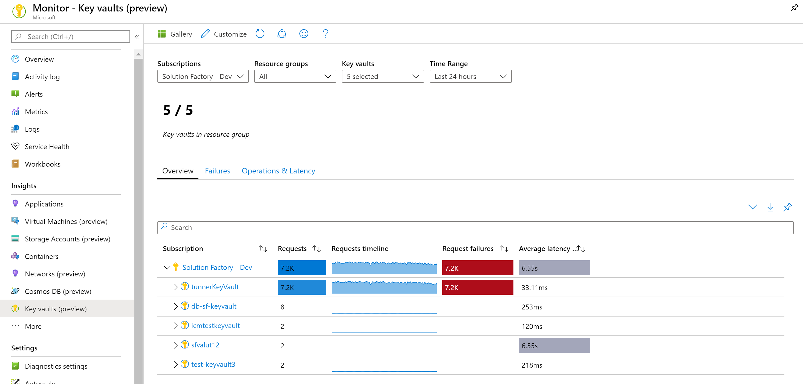
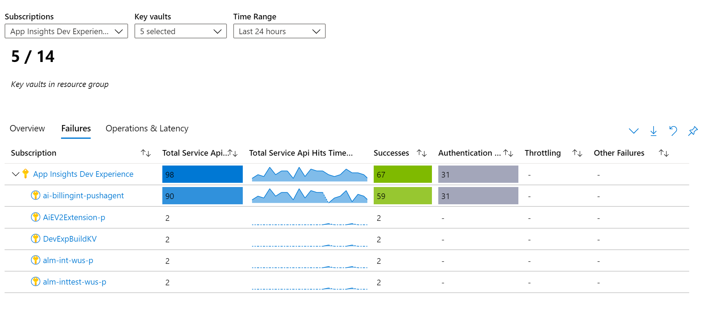
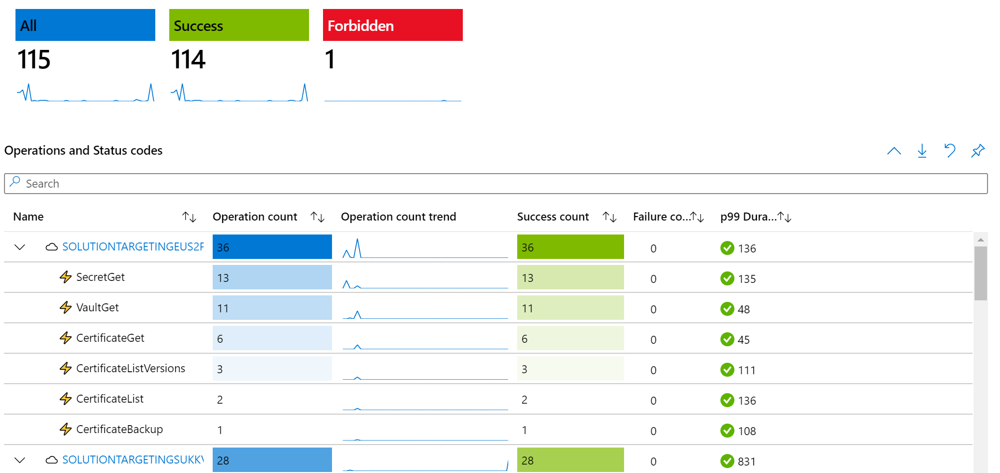
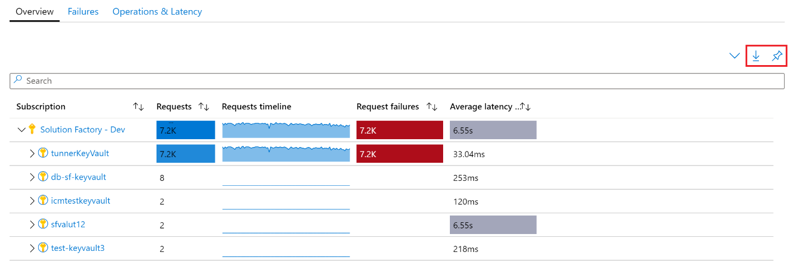
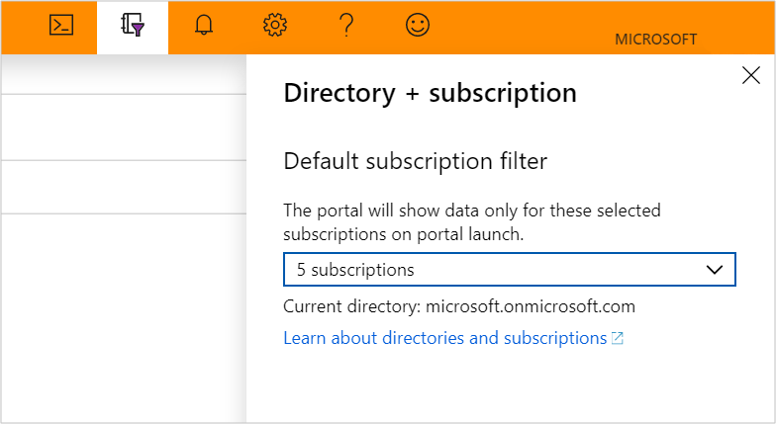

# Monitoring your key vault service with Azure Monitor for Key Vaults (preview)
Azure Monitor for Key Vaults (preview) provides comprehensive monitoring of your Azure Key Vaults by delivering a unified view of your Azure Key Vaults requests, performance, failures, and latency.
This article will help you understand how to onboard and customize the experience of Azure Monitor for Key Vaults (preview).

## Introduction to Azure Monitor for Key Vaults (preview)

Before jumping into the experience, you should understand how it presents and visualizes information.
-	**At scale perspective** showing a snapshot view of their performance based on the requests, breakdown of failures, and an overview of the operations and latency.
-   **Drill down analysis** of a particular key vault to perform detailed analysis 
-	**Customizable** where you can change which metrics you want to see, modify or set thresholds that align with your limits, and save your own workbook. Charts in the workbook can be pinned to Azure dashboard

Azure Monitor for Key Vaults combines both logs and metrics to provide a global monitoring solution. All users can access the metrics based monitoring data, however the inclusion of logs based visualizations may require users to [enabling logging of their Azure Key Vaults](https://docs.microsoft.com/azure/key-vault/key-vault-logging).

## Configuring your Key Vaults for Monitoring
*Note that enabling logs is a paid-service for monitoring

1. The Operations & Latency tab helps you determine how many and which key vaults are enabled. To begin collecting, select the ‘Enable’ button, which will bring you to a separate workbook that lists out the key vaults that require enabling diagnostic logs.

2. To enable diagnostic logs, click on the ‘Enable’ link underneath the actions column, and create a new diagnostics setting that sends logs to a Log Analytics workspace. It is recommended to send all the log to the same workspace.

3. Once the diagnostic settings are saved, you will be able to view all the logs based charts and visualizations underneath the Key Vault Insights. Please note that it may take several minutes to hours to begin populating the logs.

4. For additional assistance on how to enable diagnostic logs for your Key Vault service, read the [full guide](https://docs.microsoft.com/azure/key-vault/key-vault-logging).

## View from Azure Monitor
From Azure Monitor, you can view request, latency, and failure details from multiple key vaults in your subscription, and help identify performance problems and throttling scenarios.

To view the utilization and operations of your storage accounts across all your subscriptions, perform the following steps.

1.	Sign into the [Azure Portal](https://portal.azure.com/)

2.	Select Monitor from the left-hand pane in the Azure portal, and under the Insights section, select Key Vaults (preview).

 
## Overview Workbook

On the Overview workbook for the selected subscription, the table displays interactive key vault metrics for key vaults grouped within the subscription. You can filter results based on the options you select from the following drop-down lists:

Subscriptions – only subscriptions that have key vaults are listed.

Key Vaults – by default only up to 5 key vaults are pre-selected. If you select all or multiple key vaults in the scope selector, up to 200 key vaults will be returned. For example, if you had a total of 573 key vaults across three subscriptions that you’ve selected, only 200 vaults be displayed.

Time Range – by default, displays the last 24 hours of information based on the corresponding selections made.

The counter tile, under the drop-down list, rolls-up the total number of key vaults in the selected subscriptions and reflects how many are selected. There are conditional color-coded heatmaps for the columns of the workbook that report request, failures, and latency metrics. The deepest color has the highest value and a lighter color is based on the lowest values. 

## Failures Workbook
Select Failures at the top of the page and the Failures tab opens. It shows you the API hits, frequency over time, along with the amount of certain response codes.

 
There is conditional color-coding or heatmaps for columns in the workbook that report API hits metrics with a blue value. The deepest color has the highest value and a lighter color is based on the lowest values.

The workbook displays Successes (2xx status codes), Authentication Errors (401/403 status codes), Throttling (429 status codes), and Other Failures (4xx status codes).

To better understand what each of the status codes represent, we recommend reading through the documentation on [Azure Key Vault status and response codes](https://docs.microsoft.com/azure/key-vault/authentication-requests-and-responses).

## Operations & Latency Workbook

Select Operations & Latency workbook at the top of the page and the Operations & Latency tab opens. This tab enables you to onboard your key vaults for monitoring. For more detailed steps see the “Configuring your Key Vaults for Monitoring” section.

You can see how many of your key vaults are enabled for the logging process. If at least one vault has been configured properly, then you will be able to see tables that display the operations and status codes for each of your key vaults. You can click into the details section for a row to get additional information on the individual operation.

If you are not seeing any data for this section, reference the top section on how to enable logs for Azure Key Vault, or check the troubleshooting section below.
## Pin and export

You can pin any one of the metric sections to an Azure Dashboard by selecting the pushpin icon at the top right of the section.
 
The multi-subscription and key vaults overview or failures workbooks support exporting the results in Excel format by selecting the download icon to the left of the pushpin icon.

## Customize Azure Monitor for Key Vaults

This section highlights common scenarios for editing the workbook to customize in support of your data analytics needs:
-	Scope the workbook to always select a particular subscription or key vault(s)
-	Change metrics in the grid
-	Change the requests threshold
-	Change the color rendering

You can begin customizations by enabling the editing mode, by selecting the Customize button from the top toolbar.

 
The customizations are saved to a custom workbook to prevent overwriting the default configuration in our published workbook. Workbooks are saved within a resource group, either in the My Reports section that is private to you or in the Shared Reports section that's accessible to everyone with access to the resource group. After you save the custom workbook, you need to go to the workbook gallery to launch it.

 
Specifying a subscription or key vault
You can configure the multi-subscription and key vault Overview or Failures workbooks to scope to a particular subscription(s) or key vault(s) on every run, perform the following steps.

1.	Select **Monitor** from the portal and then select **Key Vaults (preview)** from the left-hand pane.
2.	On the **Overview** workbook, from the command bar select **Edit**.
3.	Select from the **Subscriptions** drop-down list one or more subscriptions you want it to default to. Remember, the workbook supports selecting up to a total of 10 subscriptions.
4.	Select from the **Key Vaults** drop-down list one or more accounts you want it to default to. Remember, the workbook supports selecting up to a total of 200 storage accounts.
5.	Select **Save as** from the command bar to save a copy of the workbook with your customizations, and then click **Done editing** to return to reading mode.

## Troubleshooting

This section will help you with the diagnosis and troubleshooting of some of the common issues you may encounter when using Azure Monitor for Key Vaults (preview). Use the list below to locate the information relevant to your specific issue.

### Resolving performance issues or failures

To help troubleshoot any key vault related issues you identify with Azure Monitor for Key Vaults (preview), see the (Azure Key Vault documentation)[https://docs.microsoft.com/azure/key-vault/].

### Why can I only see 200 key vaults?

There is a limit of 200 key vaults that can be selected and viewed. Regardless of the number of selected subscriptions, the number of select key vaults has a limit of 200.

### What will happen when a pinned item is clicked?

When a pinned item on the dashboard is clicked, it will open one of two things:
1.	If the Insights were saved – it will open the insights instance that the pin was saved from
2.	If the insights were unsaved – it will open a new default insights instance

### Why don’t I see all my subscriptions in the subscription picker?

We only show Subscriptions that contain key vaults, chosen from the selected subscription filter, which are selected in the “Directory + Subscription” in the Azure Portal header.

 
### I am getting an error message that the “query exceeds the maximum number of workspaces/regions allowed”, what to do now?
Currently, there is a limit to 25 regions and 200 workspaces, to view your data, you will need to reduce the number of subscriptions and/or resource groups.
### I want to make changes or add additional visualizations to KVI, how do I do so?

To make changes, select the “Edit Mode” to modify the workbook, then you can save your work as a new workbook that is tied to a designated subscription and resource group.
### What is the time-grain once we pin any part of the Workbooks?

We utilize the “Auto” time grain, therefore it depends on what time range is selected.

### What is the time range when any part of the workbook is pinned?

The time range will depend on the dashboard settings.

### Why do I not see any data for my Key Vaults under the Operations & Latency sections?

To view your logs-based data, you will need to enable logs for each of the key vaults you want to monitor. This can be done under the diagnostic settings for each key vault. You will need to send your data to a designated Log Analytics workspace.

### I have already enabled logs for my Key Vaults, why am I still unable to see my data under Operations & Latency?

Currently, diagnostic logs do not work retroactively, so the data will only start appearing once there have been actions taken to your key vaults. Therefore, it may take some time, ranging from hours to a day, depending on how active your key vault is.

### What if I want to see other data or make my own visualizations? How can I make changes to the Key Vault Insights?

You can edit the existing workbook, through the use of the edit mode, and then save your work as a new workbook that will have all your new changes.

## Next steps
Learn the scenarios workbooks are designed to support, how to author new and customize existing reports, and more by reviewing [Create interactive reports with Azure Monitor workbooks](https://docs.microsoft.com/en-us/azure/azure-monitor/app/usage-workbooks).
