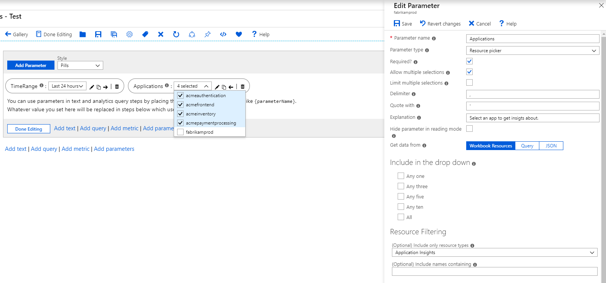
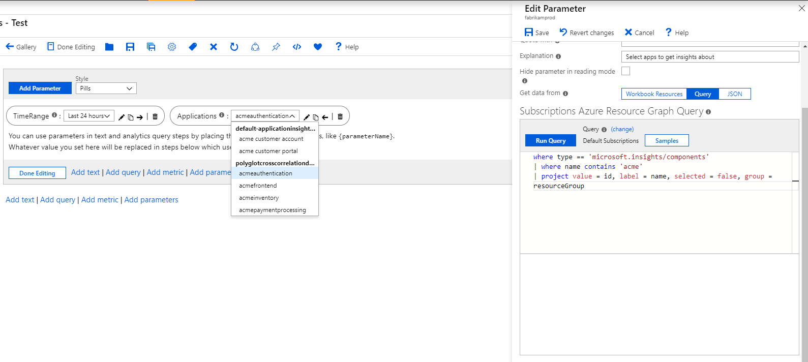
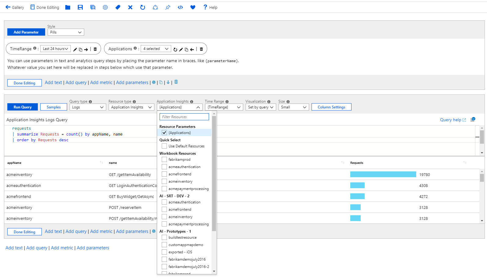

# Resource Parameters

Resource parameters allow picking of resources in workbooks. This is useful in setting the scope from which to get the data from. An example is allowing users to select the set of VMs which the charts later will use when presenting the data.

Values from resource pickers can come from the workbook context, static list or from Azure Resource Graph queries.

## Creating a resource parameter using workbook resources
1. Start with an empty workbook in edit mode.
2. Choose _Add parameters_ from the links within the workbook.
3. Click on the blue _Add Parameter_ button.
4. In the new parameter pane that pops up enter:
    1. Parameter name: `Applications`
    2. Parameter type: `Resource picker`
    3. Required: `checked`
    4. Allow multiple selections: `checked`
5. Get data from: `Workbook Resources`
6. Include only resource types: `Application Insights`
7. Choose 'Save' from the toolbar to create the parameter.



## Creating a resource parameter using Azure Resource Graph
1. Start with an empty workbook in edit mode.
2. Choose _Add parameters_ from the links within the workbook.
3. Click on the blue _Add Parameter_ button.
4. In the new parameter pane that pops up enter:
    1. Parameter name: `Applications`
    2. Parameter type: `Resource picker`
    3. Required: `checked`
    4. Allow multiple selections: `checked`
5. Get data from: `Query`
    1. Query Type: `Azure Resource Graph`
    2. Subscriptions: `Use default subscriptions`
    3. In the query control, add this snippet
    ```
    where type == 'microsoft.insights/components'
    | project value = id, label = name, selected = false, group = resourceGroup
    ```
7. Choose 'Save' from the toolbar to create the parameter.



> Note that Azure Resource Graph is not yet available in all clouds. Ensure that it is supported in your target cloud if you choose this approach.

[Azure Resource Graph documentation](https://docs.microsoft.com/en-us/azure/governance/resource-graph/overview)

## Creating a resource parameter a JSON list
1. Start with an empty workbook in edit mode.
2. Choose _Add parameters_ from the links within the workbook.
3. Click on the blue _Add Parameter_ button.
4. In the new parameter pane that pops up enter:
    1. Parameter name: `Applications`
    2. Parameter type: `Resource picker`
    3. Required: `checked`
    4. Allow multiple selections: `checked`
5. Get data from: `JSON`
    1. In the content control, add this json snippet
    ```json
    [
        { "value":"/subscriptions/<sub-id>/resourceGroups/<resource-group>/providers/<resource-type>/acmeauthentication", "label": "acmeauthentication", "selected":true, "group":"Acme Backend" },
        { "value":"/subscriptions/<sub-id>/resourceGroups/<resource-group>/providers/<resource-type>/acmeweb", "label": "acmeweb", "selected":false, "group":"Acme Frontend" }
    ]
    ```
    2. Hit the blue _Update_ button.
6. Optionally set the `Include only resource types` to _Application Insights_
7. Choose 'Save' from the toolbar to create the parameter.

## Referencing a resource parameter
1. Add a query control to the workbook and select an Application Insights resource.
2. Use the _Application Insights_ drop down to bind the parameter to the control. Doing this sets the scope of the query to the resources returned by the parameter at run time.
4. In the KQL control, add this snippet
    ```
    requests
    | summarize Requests = count() by appName, name
    | order by Requests desc
    ```
5. Run query to see the results. 



> This approach can be used to bind resources to other controls like metrics.

## Resource parameter options
| Parameter | Explanation | Example |
| ------------- |:-------------|:-------------|
| `{Applications}` | The selected resource id | _/subscriptions/<sub-id>/resourceGroups/<resource-group>/providers/<resource-type>/acmeauthentication_ |
| `{Applications:label}` | The label of the selected resource | _acmefrontend_ |
| `{Applications:value}` | The value of the selected resource | _'/subscriptions/<sub-id>/resourceGroups/<resource-group>/providers/<resource-type>/acmeauthentication'_ |
| `{Applications:name}` | The name of the selected resource | _acmefrontend_ |
| `{Applications:resourceGroup}` | The resource group of the selected resource | _acmegroup_ |
| `{Applications:resourceType}` | The type of the selected resource | _microsoft.insights/components_ |
| `{Applications:subscription}` | The subscription of the selected resource |  |
| `{Applications:subscriptionid}` | The subscription guid id of a subscription or resource |  |
| `{Applications:subid}` | The subscription guid id of a subscription or resource with ' quote |  |
| `{Applications:id}` | The guid id of a subscription |  |
| `{Applications:grid}` | A grid showing the resource properties. Useful to render in a text block while debugging  |  |

