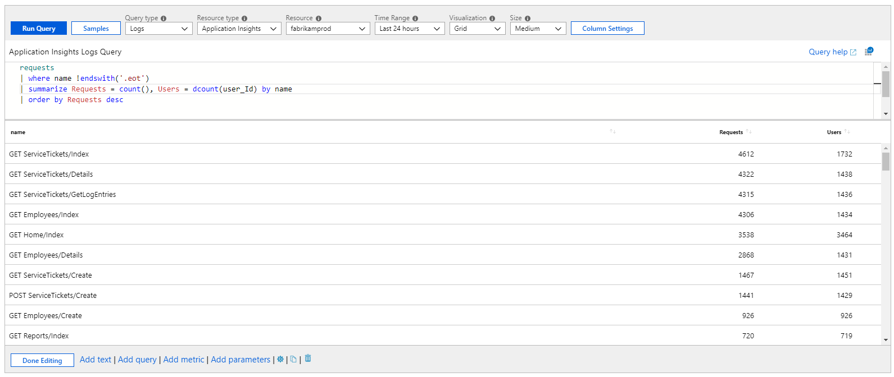
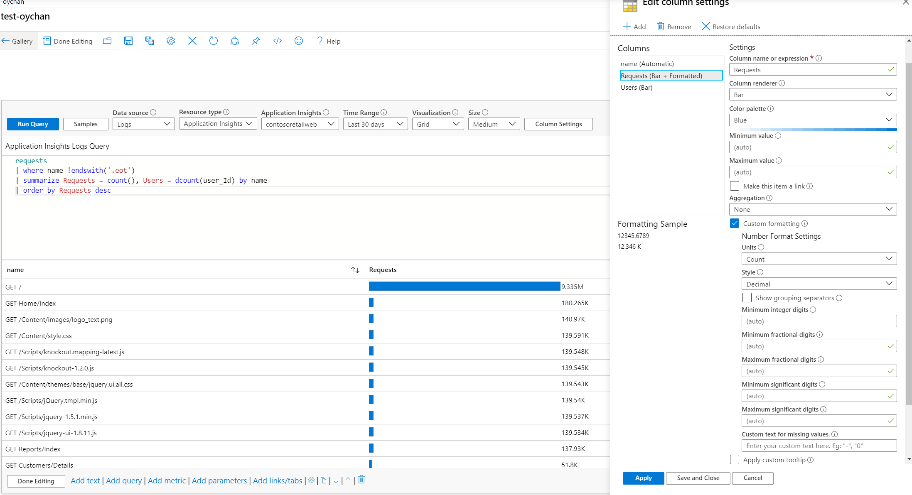
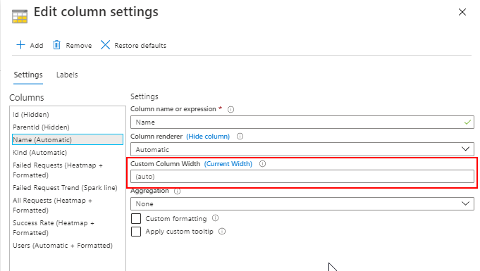
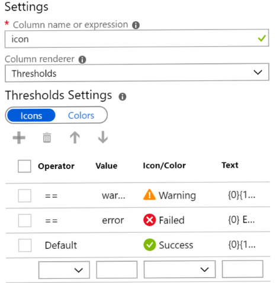
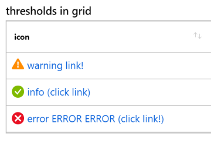
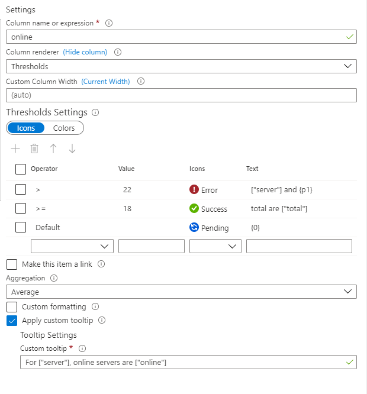
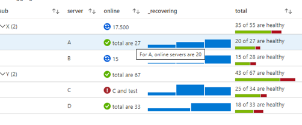

# Grid Visualization

Grids or tables are a common way to present data to users. Workbooks allow users to individually style the columns of the grid to provide a rich UI for their reports. 

The example below shows a grid that combines icons, heatmaps and spark-bars to present complex information. The workbook also provides sorting, an search box and a go-to-analytics button. 


## Adding a log-based grid
1. Switch the workbook to edit mode by clicking on the _Edit_ toolbar item.
2. Use the _Add query_ link to add a log query control to the workbook. 
3. Select the query type as _Log_, resource type (e.g. Application Insights) and the resources to target.
4. Use the Query editor to enter the KQL for your analysis (e.g. VMs with memory below a threshold)
5. Set the visualization to _Grid_
7. Set other parameters if needed - like time range, size, color palette and legend. 

Here is the edit mode version of the log grid above:


## Log chart parameters

| Parameter | Explanation | Example |
| ------------- |:-------------|:-------------|
| `Query Type` | The type of query to use | Log, Azure Resource Graph, etc. |
| `Resource Type` | The resource type to target | Application Insights, Log Analytics, or Azure-first |
| `Resources` | A set of resources to get the metrics value from | MyApp1 |
| `Time Range` | The time window to view the log chart | Last hour, Last 24 hours, etc. |
| `Visualization` | The visualization to use | Grid |
| `Size` | The vertical size of the control | Small, medium, large or full |
| `Query` | Any KQL query that returns data in the format expected by the chart visualization | _requests \| summarize Requests = count() by name_ |

## Simple Grid
Workbooks can render KQL results as a simple table. The grid below shows the count of requests and unique users per request type in an app.



```
requests
| where name !endswith('.eot')
| summarize Requests = count(), Users = dcount(user_Id) by name
| order by Requests desc
```

## Grid Styling
While a plain table shows data, it hard to read and insights don't jump out to you. Styling the grid can help you accomplish this. 

Here is the same grid styled as heatmaps.


Here is the same grid styled as bars.


### Styling a Grid Column
1. Click the _Column Settings_ button on the query control toolbar. 
2. This opens up the _Edit column settings_ context view.
3. Select the column to style.
4. Choose a column renderer (e.g. heatmap, bar, bar underneath, etc.) and related settings to style your column.

Here is an example that styles the _Request_ column as a bar:


### Column Renderers

| Column Renderer | Explanation | Additional Options |
|:------------- |:-------------|:-------------|
| `Automatic` | The default - uses the most appropriate renderer based on the column type  |  |
| `Text` | Renders the column values as text | |
| `Right Aligned` | Similar to text except that it is right aligned | |
| `Date/Time` | Renders a readable date time string | |
| `Heatmap` | Colors the grid cells based on the value of the cell | Color palette and min/max value used for scaling |
| `Bar` | Renders a bar next to the cell based on the value of the cell | Color palette and min/max value used for scaling |
| `Bar underneath` | Renders a bar near the bottom of the cell based on the value of the cell | Color palette and min/max value used for scaling |
| `Composite bar` | Renders a composite bar using the specified columns in that row. Refer [Composite Bar](./CompositeBar.md) for details | Columns with corresponding colors to render the bar and a label to display at the top of the bar |
| `Thresholds` | Renders the column value based on expressions and show respective icons or colors. The threshold expressions are evaluated in top to bottom order, icon/color of the first matching threshold will be assigned to a value. Default icon/color is assigned to a value that does not meet any of the defined thresholds| The operator, value, text, and the corresponding icon/color. The Text column takes a String format as an input. To use columns in the text, refer them as `["columnname"]`. Column name is case sensitive. Refer parameters as `{param}`. Use `{0}` and `{1}` in text to populate it with the column value and unit if specified. For example, Text can be `Success ({0} {1})`, it will be displayed as "Success (100 %)" for a value 100 and unit %. |
| `Spark bars` | Renders a spark bar in the cell based on the values of a dynamic array in the cell. E.g the Trend column form the image at the top | Color palette and min/max value used for scaling |
| `Spark lines` | Renders a spark line in the cell based on the values of a dynamic array in the cell | Color palette and min/max value used for scaling |
| `Icon` | Renders icons based on the text values in the cell. Supported values include: _cancelled, critical, disabled, error, failed, info, none, pending. stopped. question, success, unknown, uninitialized, resource, up, down, left, right, trendup, trenddown, 4, 3, 2, 1, Sev0, Sev1, Sev2, Sev3, Sev4, Fired, Resolved, Available, Unavailable, Degraded, Unknown_ |  |
| `Link` | Renders a link that when clicked performs a configurable action. Use this if you *only* want the item to be a link.  Any of the other types can *also* be a link by using the `Make this item a link` setting.  More information below |  |
| `Location` | Renders a friendly Azure region name based on a region ids |  |
| `Resource type` | Renders a friendly resource type string based on a resource type id  |  |
| `Resource` | Renders a friendly resource name and link based on a resource id  | Option to show the resource type icon  |
| `Resource group` | Renders a friendly resource group name and link based on a resource group id. If the value of the cell is not a resource group, it will be converted to one.  | Option to show the resource group icon  |
| `Subscription` | Renders a friendly subscription name and link based on a subscription id.  if the value of the cell is not a subscription, it will be converted to one.  | Option to show the subscription icon.  |
| `Hidden` | Hides the column in the grid. Useful when the default query returns more columns than needed but a project-away is not desired |  |

### Link Actions
If the `Link` renderer is selected, or the `Make this item a link` checkbox is selected, then the author can  configure a link action that will occur on clicking the cell. This usually is taking the user to some other view with context coming from the cell, or may open up a url.

For all link actions, see [Link Actions](../Links/LinkActions.md).

### Custom Formatting
Workbooks also allows users to set the number formatting of your cell values. They can do so by clicking on the _Custom formatting_ checkbox when available.

Number formatting options include:

| Formatting option | Explanation |
|:------------- |:-------------|
| `Units` | The units for the column - various options for percentage, counts, time, byte, count/time, bytes/time, etc. For example, the unit for a value of 1234 can be set to milliseconds and its rendered as 1.234s |
| `Style` | The format to render it as - decimal, currency, percent |
| `Show group separator` | Checkbox to show group separators. Renders 1234 as 1,234 in the US |
| `Minimum integer digits` | Minimum number of integer digits to use (default 1) |
| `Minimum fractional digits` | Minimum number of fractional digits to use (default 0)  |
| `Maximum fractional digits` | Maximum number of fractional digits to use |
| `Minimum significant digits` | Minimum number of significant digits to use (default 1) |
| `Maximum significant digits` | Maximum number of significant digits to use |
| `Custom text for missing values` | When a data point does not have a value, show this custom text instead of a blank |

### Custom Date Formatting
When the author has specified that a column is set to the Date/Time renderer, the author can specify custom date formatting options by using the '_Custom date formatting' checkbox.

Date formatting options include

| Formatting option | Explanation |
|:------------- |:-------------|
| `Style` | The format to render a date as short, long, full formats, or a time as short or long time formats. |
| `Show time as` | Allows the author to decide between showing the time in local time (default), or as UTC. depending on the date format style selected, the UTC/time zone information may not be displayed. |

## Custom Column Width Setting


The author can customize the width of any column in the grid using the _Custom Column Width_ field in _Column Settings_. 
* If the field is left blank, then the width will be automatically determined based on the number of characters in the column and the number of visible columns. Default unit is "ch" (characters)
* Clicking the blue _(Current Width)_ button in the label will fill the text field with the selected column's current width. 
* If a value is present in the custom width field with no unit of measurement, the default will be used. The units of measurement available are: 
    * ch - characters (Default)
    * px - pixels
    * fr - fractional unit * example below
    * % - percentage
* Input validation - if validation fails, a red guidance message will popup below the field, but user can still apply the width. If a value is present in the input, it will be parsed out and if no valid unit of measure is found, then the default will be used.   
* There is no minimum/maximum width as this is left up to the author's discretion.
* The custom column width field is disabled for hidden columns.

## Custom Tooltip

Select "Apply custom tooltip" and add a custom tooltip which acts as a tooltip for the column. You can use a mix of static text, columns, and parameters.

Use `{0}` to use the current column value

Refer to columns with `["columnName"]`

Refer to parameters with `{paramName}`

Both column name and parameter name are case sensitive.

## Examples
### Spark lines and Bar Underneath
This example shows request counts and its trend by request name


```
requests
| make-series Trend = count() default = 0 on timestamp from ago(1d) to now() step 1h by name
| project-away timestamp
| join kind = inner (requests
    | summarize Requests = count() by name
    ) on name
| project name, Requests, Trend
| order by Requests desc
```

### Heatmap with shared scales and custom formatting
This example shows various request duration metrics and its counts. The Heatmap renderer uses the minimum and maximum value set in settings, or calculates a minimum and maximum value for the column, and assigns a background color from the selected palette for the cell based on the value of the cell relative to the minimum and maximum value of the column.


```
requests
| summarize Mean = avg(duration), (Median, p80, p95, p99) = percentiles(duration, 50, 80, 95, 99), Requests = count() by name
| order by Requests desc
```

In the above example, a shared palette (green to red) and scale is used to color the mean/median/p80/p95/p99 columns, and a separate palette (blue) is used for the Requests column.

#### Shared scale
The way to get a shared scale is:
1. Use regular expressions to select more than one columns to apply a setting to. For example set the column name to _Mean|Median|p80|p95|p99_ to select them all.
2. Delete default settings for the individual columns. 

This will cause the new multi-column setting to apply its settings include a shared scale.


### Icons to represent status
This example shows custom status of requests based on the p95 duration


```
requests
| summarize p95 = percentile(duration, 95) by name
| order by p95 desc
| project Status = case(p95 > 5000, 'critical', p95 > 1000, 'error', 'success'), name, p95
```

Supported icon names include: cancelled | critical | disabled | error | failed | info | none | pending | stopped |question | success | unknown | warning | uninitialized | resource | up | down | left | right | trendup | trenddown | 4 | 3 | 2 | 1 | Sev0 | Sev1 | Sev2 | Sev3 | Sev4 | Fired | Resolved | Available | Unavailable | Degraded | Unknown | Blank

### Sample: using thresholds with links to assign icons and open different workbooks

For example, using the following JSON query inside a workbook on an Application Insights resource:
```json
[ 
    { "name": "warning", "link": "Community-Workbooks/Performance/Performance Counter Analysis" },
    { "name": "info", "link": "Community-Workbooks/Performance/Performance Insights" },
    { "name": "error", "link": "Community-Workbooks/Performance/Apdex" }
]
```

And the following threshold settings:



And the following workbook link settings:


Will result in the following grid:



Where each link in the grid opens up a different workbook template for that Application Insights resource.


### Fractional Units and Percentages
The fractional unit is a commonly used dynamic unit of measurement in various types of grids. As the window size/resolution changes, the fr width changes as well. 

The below image shows a table with 8 columns that are 1fr width each and are all equal widths. As the window size changes, the width of each column changes proportionally. 


The image below shows the same table, except the first column is set to 50% width. This will set the column to half of the total grid width dynamically. Resizing the window will continue to retain the 50% width unless the window size gets too small - these dynamic columns have a minimum width based on their contents. The remaining 50% of the grid is divided up by the 8 total fractional units. The "kind" column below is set to 2fr, so it takes up 2/8ths of remaining space. As the other columns are 1fr each, they each take up 1/8th of the right half of the grid. 


Combining fr, %, px, and ch widths is possible and works similarly to the above examples. The widths that are set by the static units, ch and px, they're hard constants that won't change even if the window/resolution is changed. The columns set by % will take their % based on the total grid width (might not be exact due to the aforementioned minimum widths). The columns set with fr will just split up the remaining grid space based on the number of fractional units they are allotted.


### Thresholds with column and parameter reference in text and custom tooltip
For following JSON data
```
[
    {"sub":"X", "server": "A", "online": 20, "_recovering": [3,4,5], "offline": 4, "total": 27},
    {"sub":"X", "server": "B", "online": 15, "_recovering": [2,2,5], "offline": 5, "total": 28},
    {"sub":"Y", "server": "C", "online": 25, "_recovering": [3,6,5], "offline": 5, "total": 34},
    {"sub":"Y", "server": "D", "online": 18, "_recovering": [3,5], "offline": 9, "total": 33}
]
```
and p1 parameter with value "test", and the following Threshold settings


The 'online' columns value are rendered like following:

